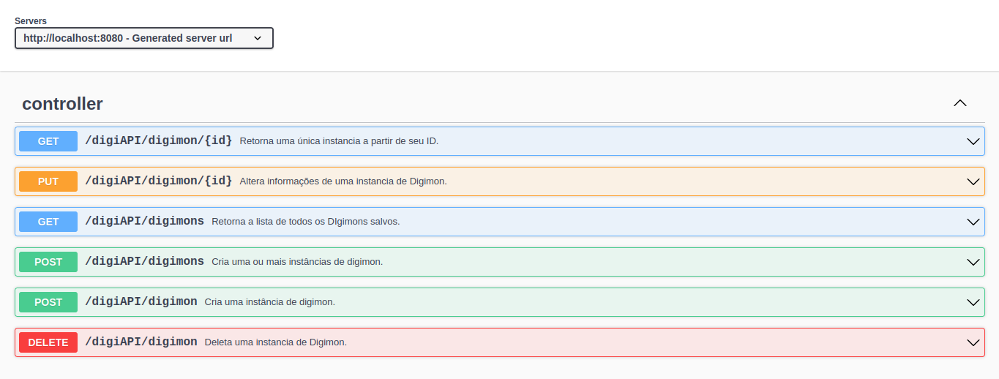
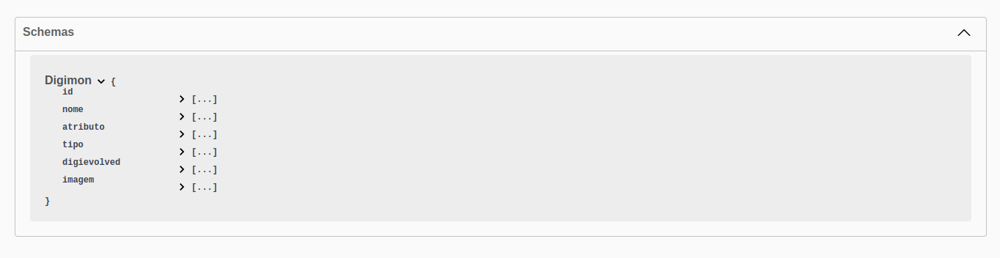
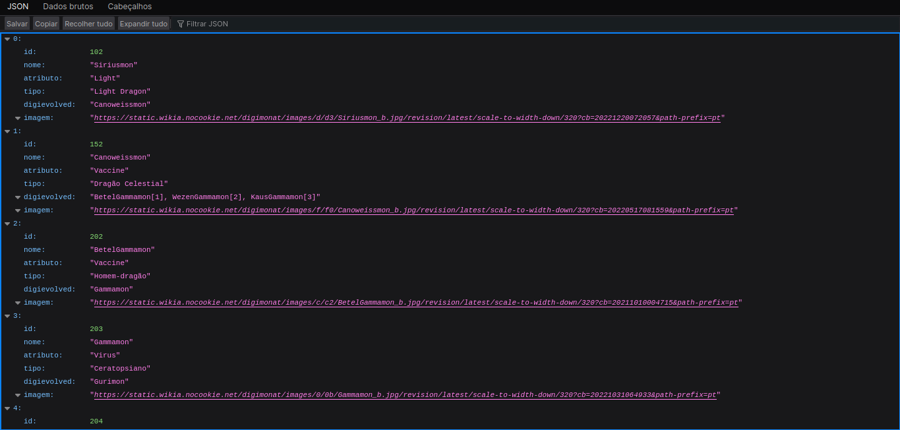

# DigiAPI

Uma API com informações sobre Digimons.

<table>
  <tr>
    <td></td>
    <td></td>
  </tr>
</table>

## Tecnologias Usadas
Java, SpringBoot, Hibernate, SpringDoc OpenAPI, MySQL, Postman

## Prints do projeto
<table>
  <tr>
    <td></td>
    <td></td>
    <td></td>
  </tr>
</table>

## Execução
Como o projeto não está hospedado em nenhum serviço de nuvem (R$R$R$ infelizmente R$R$R$), para executá-lo pode-se:
1. **Clonar o repositório** e utilizá-lo localmente (adicionar as próprias instâncias no banco de dados que está configurado para esperar um MySQL na porta 3306).
2. **Utilizar o arquivo .JSON mais recente** aqui disponibilizado. Ele possui todas as instâncias criadas até então. Para adicionar uma lista de instâncias (para evitar ter que adicionar um a um) há um método específico para isso ```Controller.salvaDigimons```.

    2.1 Logo, pode-se clonar o repositório e, ao inicializá-lo, utilizando a IDE de sua preferência, pela linha de comando, ou gerando o arquivo .jar com ```mvn clean package```, basta acessar a URL: http://localhost:8080/swagger-ui/index.html (caso mantenha a porta padrão) e utilizar o método citado anteriormente passando o conteúdo do arquivo .JSON no corpo da requisição POST.

**Link para clone do repositório**
   ```bash
   https://github.com/Maracujacake/DigiAPI.git
   cd DigiAPI
  ```

**Contribuições**

Caso queira contribuir para o projeto, além da verificação, manutenção e melhoria do código em si, é de vital importância o acréscimo de informações sobre digimons no próprio arquivo .JSON se necessário.


***Observações Finais***

Criar o banco ''digimon'' pode evitar alguns erros.
